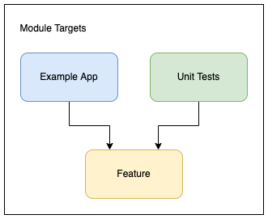
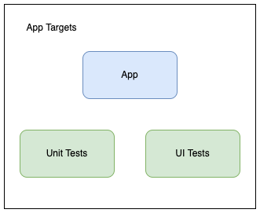
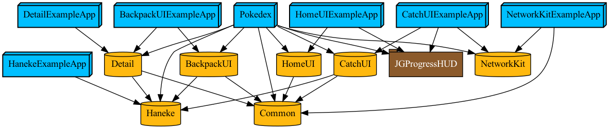

    

This repo is deprecated and [the latest version is here](https://github.com/ronanociosoig-200/Tuist-Pokedex)

  <a href="#architecture">Architecture</a>
  • <a href="#implementation">Implementation</a>
  • <a href="#automated-testing">Automated Testing</a>

# Pokedex

 

This simple 4-screen iOS app is a Swift code example to demonstrate a micro-feature approach to modularisation based on Tuist, that fetches data from an [API](https://pokeapi.co), parses the response, displays some of the data, stores it locally, and can retrieve it. The networking module has implementations for both Combine and Async/Await. The initial aim was to keep this as simple as possible but follow best practices and standard design patterns. 

	- Home Scene
	- Catch the Pokemon Scene 
	- Backpack Scene
	- Details Scene

The Home scene has 2 buttons, the first opens the Catch scene, the latter opens the backpack scene. 

On tapping the first button, it will make a call to the API, and depending on the response, display a new Pokemon, inform the user that this can be caught or if it has already been caught, or an error and ask the user to try again. 

Choosing to catch the Pokemon will dismiss the screen, store the data to the file system, and return to the Home scene. 

Tapping on the lower button opens the Backpack scene, which displays all the caught Pokemons in a grid. Tapping on a Pokemon opens the Detail Scene and it provides more details in terms of properties and the date and time it was caught.

## Tuist

Run the code in this repo requires the prior installation of [tuist.io](https://tuist.io) version 2.6.0. It is not compatible with Tuist 3.x. Generate the project and workspace by running [`tuist generate`](https://tuist.io/docs/usage/get-started/), and then `tuist focus Pokedex` to open the project.

## Modular Approach
										     
The project implements a simplified version of the micro-feature modular architectual pattern suggested by the Tuist team ([see here](https://docs.tuist.io/building-at-scale/microfeatures))							     
Each feature module has 3 targets: The framework target, a unit test target and an example app target.

    

The application target also has a unit test target and a UI testing target.

    

Each scene is definded as a separate feature module (Home, Catch, Backpack and Detail), along with additional modules for Common, Network, Haneke image library, and the main application. The project can focus on any one, or a combination of these modules, the testing target, or the example application that validates each module. 

Run `tuist edit` and view the Project.swift manifest to see the structure and how dependencies are defined and linked.

The dependency graph shows the example apps, the feature modules and the common shared module, along with the network and Haneke image library, as well as JGProgressHUD, which is loaded as an SPM.
 

    

## Architecture 

    

At the root level, the application employs the [coordinator pattern](http://khanlou.com/2015/01/the-coordinator/) to remove the dependency between screens, enabling better reusability and testability. 

The presentation layer uses the well-known [Model-View-Presenter pattern](https://en.wikipedia.org/wiki/Model–view–presenter), giving a clean seperation of concerns between the view, state and the data.

A wireframe structure is used to manage the dependency injection in the view controller and presenter.

The data provider class acts as a data access layer, which has extensions defined by protocols for each screen and the music player. This ensures that access to functions are restricted, and it facilitates unit and integration testing by mocking the data layer. It initiates calls to a networking service and receives a response.

An AppData class is used to maintain global state across screens, with the data provider controling its access. View controllers have read-only access, and data must be updated via actions. This is a form of uni-directional data flow that helps prevent inconsistencies in the screens and the data presented. 

## Implementation 

The coordinator is in charge of what is displayed on the screen. It contains the code to display the screens, show loading HUD, or an alert message. 

It also receives call backs from the data provider when a request has completed its job, or an error has occurred. This in turn notifies the current scene to update or display an alert. 

 
## Manual & Automated Testing
The project has unit and UI tests. The unit tests are both at the feature level in some cases as well at the application level.

Run `tuist test` to execute all the tests, or `tuist test <feature_name>` for running the tests on specific modules.

The project also has 2 custom schemes to help with manual validation: "UITesting" and "AsyncNetworkTesting". Each of these have the launch argument added. 
