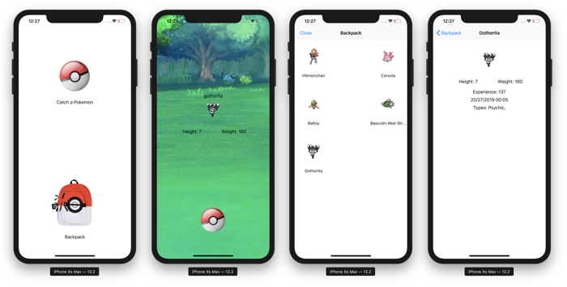
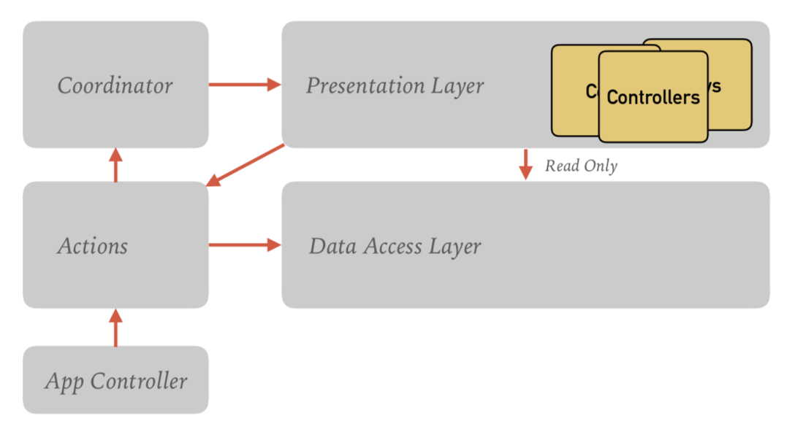
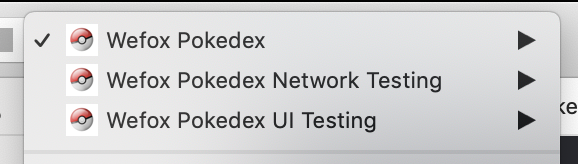

    

  <a href="#architecture">Architecture</a>
  • <a href="#implementation">Implementation</a>
  • <a href="#automated-testing">Automated Testing</a>

# Pokedex

This simmple iOS app is a Swift code example to demonstrate an approach used to fetch data from an [API](https://pokeapi.co), parse the response, display some of the data, store it locally, and retrieve it. The aim was to keep this as simple as possible but follow best practices in terms of SOLID principles and design patterns. 

It consists of 4 scenes:  
Home Scene  
Catch the Pokemon Scene  
Backpack Scene 
Details Scene 

The Home scene has 2 buttons, the first opens the Catch scene, the latter opens the backpack scene. 

On tapping the first button, it will make a call to the API, and depending on the response, display a new Pokemon, inform the user that this can be caught or if it has already been caught, or an error and ask the user to try again. 

Choosing to catch the Pokemon will dismiss the screen, store the data to the file system, and return to the Home scene. 

Tapping on the lower button opens the Backpack scene, which displays all the caught Pokemons in a grid. Tapping on a Pokemon opens the Detail Scene and it provides more details in terms of properties and the date and time it was caught.

## Architecture 

    

At the root level, the application employs the [coordinator pattern](http://khanlou.com/2015/01/the-coordinator/) to remove the dependency between screens, enabling better reusability and testability. 

The presentation layer uses the well-known [Model-View-Presenter pattern](https://en.wikipedia.org/wiki/Model–view–presenter), giving a clean seperation of concerns between the view, state and the data.

A wireframe structure is used to manage the dependency injection in the view controller and presenter.

The data provider class acts as a data access layer, which has extensions defined by protocols for each screen and the music player. This ensures that access to functions are restricted, and it facilitates unit and integration testing by mocking the data layer. It initiates calls to a networking service and receives a response.

An AppData class is used to maintain global state across screens, with the data provider controling its access. View controllers have read-only access, and data must be updated via actions. This is a form of uni-directional data flow that helps prevent inconsistencies in the screens and the data presented. 

## Implementation 

The coordinator is in charge of what is displayed on the screen. It contains the code to display the screens, show loading HUD, or an alert message. 

It also receives call backs from the data provider when a request has completed its job, or an error has occurred. This in turn notifies the current scene to update or display an alert. 

Moya is used in the networking layer to help in 3 ways:  
- Make requests type safe by defining them as enumerations.  
- Help with debugging networking calls using the logging plugin.  
- Help with testing for both integration and UI tests by stubbing responses, giving HTTP status codes and mock data.
 
## Automated Testing
The project has unit, integration and UI tests.

The project has 3 schemes that separate out the different types of testing. 
In the main scheme, the standard XCTests are enabled. 

The network testing scheme takes advantge of the [Moya](https://github.com/Moya/Moya) plugin to enable network logging. 

The final scheme employs the stubbing feature of [Moya](https://github.com/Moya/Moya) to return mock data. The data returned in the mmocks for the UI tests is controlled by the launch argument passed into the test. In this way Moya can return either a standard HTTP 200 response code, or a custom code such as 401. This could be easily extended with custom endpoint closures for all the error codes that needs to be validated. 

